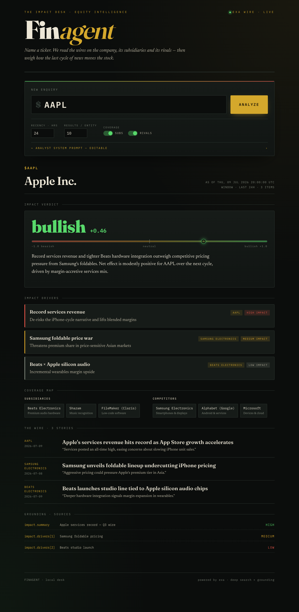
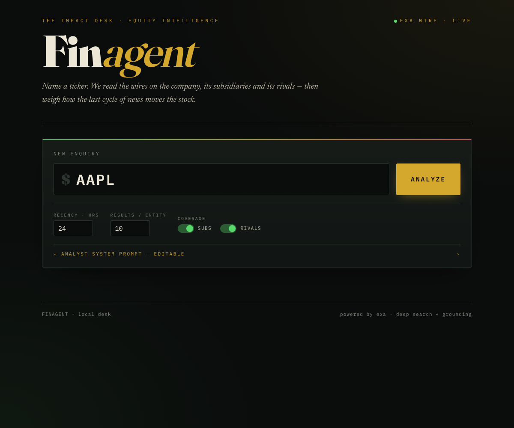

<h1 align="center">finagent-exa</h1>

<p align="center">
  <em>Name a ticker. Get a grounded read on how the last cycle of news — for the company,
  its subsidiaries, and its rivals — moves the stock.</em>
</p>

<p align="center">
  
  
  
  
</p>

---

**finagent-exa** is a small, self-contained Python library for equity news-impact analysis,
powered by the [Exa](https://exa.ai) web-search API. Given a stock ticker it:

1. **Discovers** the company's subsidiaries and competitors (live, via Exa structured search),
2. **Pulls** recent news on the ticker and every related entity,
3. **Synthesizes** a grounded impact verdict — sentiment, score, drivers — with source citations,

and returns it as a strongly-typed `TickerAnalysis` object. It's designed to be handed to
**any agent framework** (Pydantic AI, Claude Agent SDK, Strands, or a plain agent loop) as a
tool result — the calling agent is the downstream "reasoning model."

> **Only `EXA_API_KEY` is required.** No second LLM key: Exa does both the retrieval *and* the
> grounded synthesis (`type="deep"` + `output_schema`).

<p align="center">
  
</p>

## Table of contents

- [Features](#features)
- [Quick start](#quick-start)
- [Usage](#usage)
  - [Library](#library)
  - [CLI](#cli)
  - [Web UI](#web-ui)
  - [As an agent tool](#as-an-agent-tool)
- [Output shape](#output-shape)
- [How it works](#how-it-works)
- [Project layout](#project-layout)
- [Development](#development)
- [Configuration](#configuration)
- [License](#license)

## Features

- 🔎 **Live entity discovery** — subsidiaries & competitors resolved from the web per request.
- 📰 **Multi-entity news sweep** — one Exa search per entity, tunable recency window (default 24h).
- ⚖️ **Grounded impact synthesis** — deep search + `output_schema` returns sentiment, a −1↔+1
  score, and specific impact drivers, each with field-level citations from Exa's grounding.
- 🧩 **Framework-agnostic tool** — `build_tool_spec("anthropic" | "openai")` + `run_tool(...)`
  drop straight into Claude Agent SDK, Pydantic AI, Strands, OpenAI tool-calling, etc.
- 🖥️ **Local web UI** — a dark "financial broadsheet" Flask frontend with an *editable analyst
  system prompt* so you can reframe the analysis per run.
- 🧪 **Fully tested** — 29 unit tests with Exa mocked (no network in CI) + an opt-in live test.
- 🔑 **Single dependency surface** — only `EXA_API_KEY`; `.env` auto-loaded.

## Quick start

```bash
git clone https://github.com/SamanvayMS/finagent-exa.git
cd finagent-exa
./scripts/setup.sh          # venv + install + .env + tests
# add your key:
echo 'EXA_API_KEY=your_key_here' > .env      # get one at https://dashboard.exa.ai
./scripts/run_web.sh        # open http://127.0.0.1:5000
```

Prefer `make`? `make setup`, then `make web` or `make cli TICKER=AAPL`.

Requires [`uv`](https://docs.astral.sh/uv/) (fast Python package manager). Install it with
`curl -LsSf https://astral.sh/uv/install.sh | sh`.

## Usage

### Library

```python
from finagent import analyze_ticker

result = analyze_ticker("AAPL", recency_hours=24)
print(result.model_dump_json(indent=2))
```

All arguments except `ticker` are optional:

| Argument | Default | Description |
|---|---|---|
| `recency_hours` | `24` | How far back to include news. |
| `num_results` | `10` | Max news results per entity. |
| `include_subsidiaries` | `True` | Include subsidiary news. |
| `include_competitors` | `True` | Include competitor news. |
| `system_prompt` | *(built-in)* | Override the analyst prompt that frames the synthesis. |
| `api_key` | `EXA_API_KEY` | Pass a key explicitly instead of via env. |

### CLI

```bash
python -m finagent AAPL --recency-hours 24
python -m finagent TSLA --num-results 5 --no-competitors
# or via the wrapper (loads .env, uses uv):
./scripts/run_cli.sh NVDA --recency-hours 48
```

Prints the full `TickerAnalysis` as indented JSON.

### Web UI

```bash
./scripts/run_web.sh          # http://127.0.0.1:5000
```

Enter a ticker, tune recency / results / coverage, optionally customize the analyst system
prompt, and the page renders the sentiment verdict, impact drivers, discovered subsidiaries &
competitors, the news wire, and grounded citations.

<p align="center">
  
</p>

### As an agent tool

```python
from finagent import build_tool_spec, run_tool

anthropic_tool = build_tool_spec("anthropic")   # {name, description, input_schema}
openai_tool    = build_tool_spec("openai")      # {type: "function", function: {...}}

# When the model calls the tool, execute it and feed the dict back as the tool result:
result_dict = run_tool({"ticker": "AAPL", "recency_hours": 24})
```

The tool schema exposes `ticker`, `recency_hours`, `num_results`, `include_subsidiaries`,
`include_competitors`, and `system_prompt`.

## Output shape

`analyze_ticker(...)` returns a Pydantic `TickerAnalysis`:

```jsonc
{
  "ticker": "AAPL",
  "company_name": "Apple Inc.",
  "as_of": "2026-07-09T20:00:00Z",
  "recency_hours": 24,
  "entities": {
    "subsidiaries": [{ "name": "Beats Electronics", "relation": "subsidiary", "description": "..." }],
    "competitors":  [{ "name": "Samsung Electronics", "relation": "competitor", "description": "..." }]
  },
  "news_items": [
    { "title": "...", "url": "...", "source_entity": "AAPL", "published_date": "2026-07-09", "highlights": ["..."] }
  ],
  "impact": {
    "sentiment": "bullish",          // bullish | bearish | neutral | mixed
    "score": 0.46,                    // -1.0 .. 1.0
    "summary": "...",
    "drivers": [
      { "headline": "...", "effect": "...", "magnitude": "high", "related_entity": "AAPL" }
    ]
  },
  "citations": [
    { "field": "impact.summary", "url": "...", "title": "...", "confidence": "high" }
  ]
}
```

Citations come straight from Exa's `output.grounding` — the library never fabricates them.

## How it works

```
                 ┌──────────────┐
   ticker ─────▶ │ discovery.py │  Exa search + output_schema  → subsidiaries, competitors
                 └──────┬───────┘
                        ▼
                 ┌──────────────┐
                 │   news.py    │  Exa search per entity (type=auto, highlights, recency)
                 └──────┬───────┘
                        ▼
                 ┌──────────────┐
                 │ analysis.py  │  Exa deep search + output_schema → grounded Impact + citations
                 └──────┬───────┘
                        ▼
                 ┌──────────────┐
                 │   agent.py   │  analyze_ticker() → TickerAnalysis (the handoff object)
                 └──────────────┘
```

`client.py` is the **only** module that imports the Exa SDK — every other module depends on its
thin, typed wrapper, which is what makes the whole pipeline trivially mockable in tests.

## Project layout

```
finagent-exa/
├── src/finagent/
│   ├── models.py        # Pydantic models (TickerAnalysis, Entity, NewsItem, Impact, ...)
│   ├── config.py        # defaults + get_api_key + error types
│   ├── client.py        # thin Exa SDK wrapper (only module importing exa_py); retries
│   ├── discovery.py     # discover_entities() — subsidiaries & competitors
│   ├── news.py          # fetch_news() — per-entity news retrieval
│   ├── analysis.py      # synthesize_impact() — grounded deep-search synthesis
│   ├── agent.py         # analyze_ticker() — orchestration
│   ├── tool.py          # build_tool_spec() + run_tool() adapters
│   └── __main__.py      # CLI entry point
├── app.py               # Flask web UI
├── templates/index.html # the "financial broadsheet" frontend
├── tests/               # 29 unit tests (Exa mocked) + opt-in live test
├── scripts/             # setup.sh, run_web.sh, run_cli.sh
├── docs/superpowers/    # design spec + implementation plan
└── assets/              # screenshots
```

## Development

```bash
make setup        # or ./scripts/setup.sh
make test         # unit tests (Exa mocked, no network)
make test-live    # opt-in: hits the real Exa API (needs EXA_API_KEY + RUN_LIVE=1)
make help         # list all targets
```

The suite mocks the Exa client, so `make test` runs offline and deterministically. The single
live test is skipped unless both `RUN_LIVE=1` and `EXA_API_KEY` are set.

## Configuration

| Variable | Required | Purpose |
|---|---|---|
| `EXA_API_KEY` | ✅ | Exa API key. Get one at [dashboard.exa.ai](https://dashboard.exa.ai). |
| `RUN_LIVE` | — | Set to `1` to enable the live integration test. |

`.env` is loaded automatically by the CLI and web app (via `python-dotenv`) and is git-ignored —
your key never gets committed. Copy `.env.example` to `.env` to start.

## License

[MIT](LICENSE) © 2026 Samanvay. Built on [Exa](https://exa.ai).
